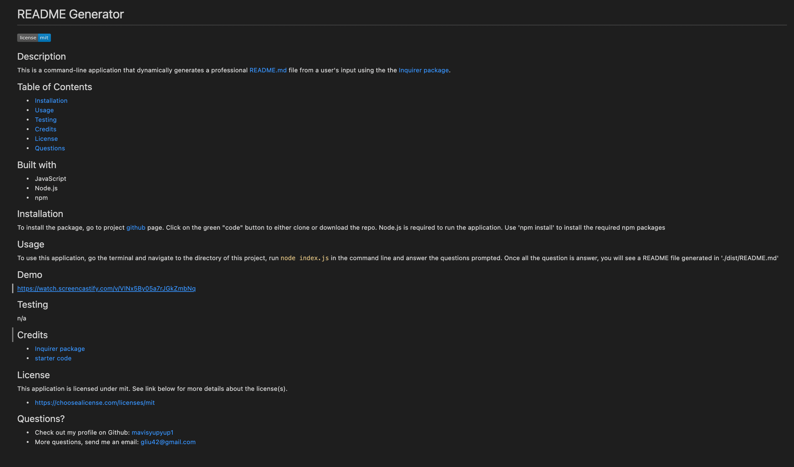

# README Generator

## Description
This is a command-line application that dynamically generates a professional README.md file from a user's input using the the [Inquirer package](https://www.npmjs.com/package/inquirer).

## Table of Contents 
* [Installation](#installation)
* [Usage](#usage)
* [Testing](#testing)
* [Credits](#credits)
* [License](#license)
* [Questions](#questions)

## Built with
* JavaScript
* Node.js
* npm

## Installation
To install the package, go to project [github](https://github.com/mavisyupyup1/readme-generator) page. Click on the green "code" button to either clone or download the repo.  Node.js is required to run the application. Use 'npm install' to install the required npm packages

## Usage 
To use this application, go the terminal and navigate to the directory of this project, run `node index.js` in the command line and answer the questions prompted. Once all the question is answer, you will see a README file generated in './dist/README.md'

## Demo
https://watch.screencastify.com/v/FnzFokX0B3CP6nsRY3iQ

## Testing
n/a

## Credits
* [Inquirer package](https://www.npmjs.com/package/inquirer)
* [starter code](https://github.com/coding-boot-camp/potential-enigma)

## License
 This application is licensed under mit. See link below for more details about the license(s).
  * https://choosealicense.com/licenses/mit
  
## Questions?
* Check out my profile on Github:  <a class="ml-2 my-1 px-2 py-1 bg-secondary text-dark" href="https://github.com/mavisyupyup1">mavisyupyup1</a>
* More questions, send me an email: gliu42@gmail.com

